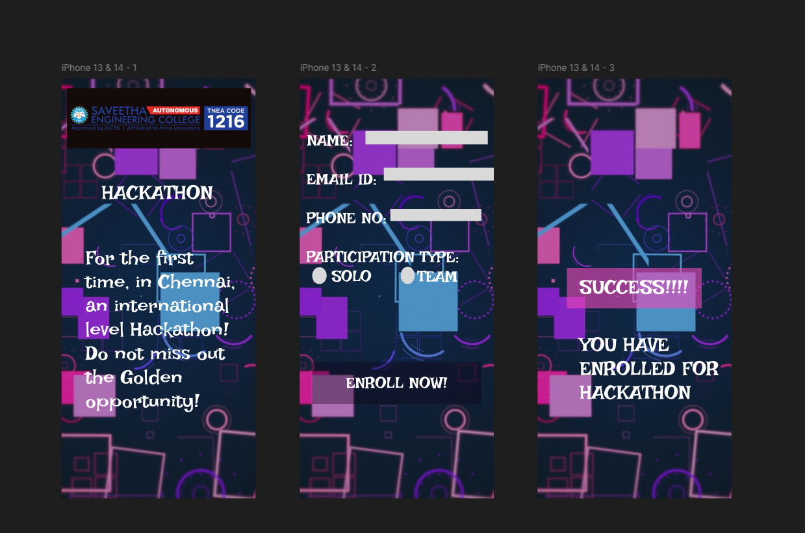

# Ex09 Event Registration Web Application
## Date: 26.12.25
# referance no: 25005345

## AIM:
To design, develop and deploy a web application for event registration.

## DESIGN STEPS:

### Step 1:
Create a new frame.

### Step 2:
Select any one preset size of your choice.

### Step 3:
Select the shapes you need.

### Step 4:
Import images as needed.

### Step 5:
Create pages based on your need and link them.

### Step 6:

Validate the HTML and CSS code.

### Step 6:

Publish the website in the given URL.

## DESIGN TOOL:
Figma

## CODE:
~~~
page 01:

<!DOCTYPE html>
<html>
  <head>
    <meta name="viewport" content="width=device-width, initial-scale=1" />
    <meta charset="utf-8" />
    <link rel="stylesheet" href="globals.css" />
    <link rel="stylesheet" href="style.css" />
  </head>
  <body>
    

      

      
SUCCESS!!!!

      
YOU HAVE ENROLLED FOR HACKATHON

    

  </body>
</html>

page 02:

<!DOCTYPE html>
<html>
  <head>
    <meta name="viewport" content="width=device-width, initial-scale=1" />
    <meta charset="utf-8" />
    <link rel="stylesheet" href="globals.css" />
    <link rel="stylesheet" href="style.css" />
  </head>
  <body>
    

      

        NAME:  EMAIL ID:  PHONE NO:  PARTICIPATION TYPE: &nbsp;&nbsp;&nbsp;&nbsp;
        SOLO&nbsp;&nbsp;&nbsp;&nbsp;&nbsp;&nbsp;&nbsp;&nbsp; TEAM
      

      

      

      

      

      

      

      
ENROLL NOW!

    

  </body>
</html>

page 03:

<!DOCTYPE html>
<html>
  <head>
    <meta name="viewport" content="width=device-width, initial-scale=1" />
    <meta charset="utf-8" />
    <link rel="stylesheet" href="globals.css" />
    <link rel="stylesheet" href="style.css" />
  </head>
  <body>
    

      
HACKATHON

      

      
      

        For the first time, in Chennai, an international level Hackathon! Do not miss out the Golden
        opportunity!
      

    

  </body>
</html>
~~~

## OUTPUT:

## RESULT:
The program to design, develop and deploy a web application for event registration is completed successfully.
